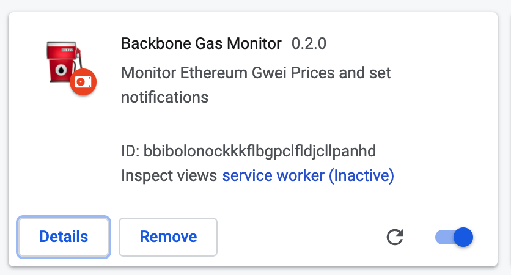

# Backbone Gas Price Monitor

## Overview 

Strictly minamlist chrome extenstion. 

No analytics are collected on you, zero.

## Usage 

### Icon in toolbar with realtime price changes

### Approx. Transaction Pricing Dialog box w/ Notifications settings 

## Install 

1. Download the `packged` zip distribution found in the releases - [backbonecabal/sushiswap-gas-watcher/releases/download/v2.0.0/backbone-gwei-chrome.zip](https://github.com/backbonecabal/sushiswap-gas-watcher/releases/download/v2.0.0/backbone-gwei-chrome.zip)

2. Unzip distribution 

3. Go to Extenstions and enable `Developer Mode`

4. In top left hand side, click `load unpacked` and navigate to where you extracted the zip distribution in step 1

You should see the extenstion with the values below

## License 

MIT
